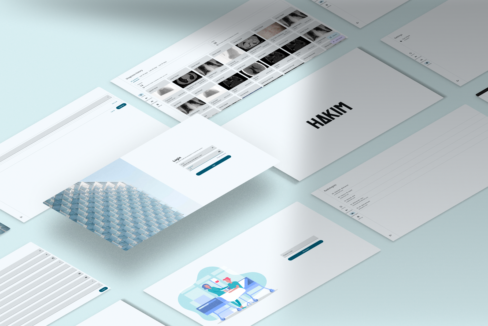

# Hakim – Medical Diagnosing System using Artificial Intelligence

<p align="center">
  <a href="LICENSE">
    
  </a>
</p>

A full-stack medical diagnostic platform developed as a graduation project. It enables radiologists to manage patients, upload scan images, and receive AI-powered disease predictions in real time. It provides secure authentication for radiologists, robust management of patient records with controlled access, and seamless integration of advanced AI models for scan image analysis and disease prediction. Built with a Django REST API backend and a cross-platform desktop application frontend.

---

## Screenshots

<p align="center">
  
</p>
<p align="center">
  
</p>

---

## Project Components

1. **Backend (REST API)**  
   - Django + Django REST Framework  
   - JWT-based authentication, permissions  
   - Radiologist & Patient management  
   - AI prediction endpoints

2. **AI Module**  
   - Pre-trained models for Chest X‑ray, Brain Tumor, Chest CT, Bone Fracture, Skin Disease  
   - Modular, scalable loading system  
   - Easy to plug new models

3. **Desktop application**  
   - Desktop application via Compose Multiplatform  
   - Login, patient form, image upload, prediction display  
   - Light & Dark mode toggle  
   - Cross-platform support (Linux / Windows / macOS)

4. **Web application**
   - Web application via Vanilla JS with HTML & CSS
   - Simple web view for availability

---

## Features

- Secure JWT-based authentication  
- Radiologist & Patient account management  
- AI-powered disease prediction using pre-trained models  
- Unified API response structure  
- PostgreSQL database support  
- API documentation via Swagger/OpenAPI  
- Compose Multiplatform desktop app (Linux/Windows/macOS)  
- Light & Dark mode support  
- Web interface for availability

---

## AI Infrastructure

The system integrates a suite of advanced deep learning models trained on medical imaging datasets to assist radiologists in diagnosing a wide range of conditions. It currently supports **Chest X‑ray** classification (14 diseases), **Brain Tumor** detection, **Chest CT** lung cancer classification, **Bone Fracture** detection, and **Skin Disease** classification across bacterial, viral, and fungal infections.

The AI infrastructure is **modular and highly scalable**, allowing seamless integration of new models without modifying core functionality. This design enables continuous growth to accommodate new diagnostic tasks or imaging modalities in clinical environments.

---

## Environment Variables

Create a `.env` file in the `server side` directory with the following variables:

```env
# Django secret key
DJANGO_SECRET_KEY=your-secret-key

# Debug mode (set to True for development)
DEBUG=True

# Allowed hosts (comma-separated)
ALLOWED_HOSTS=localhost,127.0.0.1

# Database configuration
DB_NAME=your_db_name
DB_USER=your_db_user
DB_PASSWORD=your_db_password
DB_HOST=localhost
DB_PORT=5432

# Email configuration (optional, for notifications)
EMAIL_BACKEND=django.core.mail.backends.smtp.EmailBackend
EMAIL_HOST=smtp.example.com
EMAIL_HOST_USER=your@email.com
EMAIL_HOST_PASSWORD=your-email-password
EMAIL_PORT=587
EMAIL_USE_TLS=True
EMAIL_USE_SSL=False
DEFAULT_FROM_EMAIL=your@email.com
```

> **Note:**  
> - All AI model files must be placed in `server side/backend/core/ai/models/` as described above.
> - Never commit your `.env` file to version control.

---

## Tech Stack

- **Backend:** [Django](https://www.djangoproject.com/), [Django REST Framework](https://www.django-rest-framework.org/), [SimpleJWT](https://github.com/jazzband/django-rest-framework-simplejwt), [PostgreSQL](https://www.postgresql.org/), [drf-spectacular](https://drf-spectacular.readthedocs.io/), [django-silk](https://github.com/jazzband/django-silk)  
- **AI Models:** [PyTorch](https://pytorch.org/) & [TensorFlow](https://www.tensorflow.org/)  
- **Destop:** [Kotlin](https://kotlinlang.org/), [Compose Multiplatform](https://www.jetbrains.com/lp/compose-multiplatform/)  
- **Version Control:** [Git](https://git-scm.com/), [GitHub](https://github.com/)

---

## Setup Instructions

### 1. Clone with Submodules

```bash
git clone --recurse-submodules https://github.com/<your-org-or-username>/graduation-project.git
cd graduation-project
```

### 2. Backend Setup

```bash
cd "server side"
python -m venv venv
source venv/bin/activate
pip install -r requirements.txt
cd backend
python manage.py makemigrations users patients scans
python manage.py migrate
python manage.py runserver
```

---

## 📄 License

This project is licensed under the [Creative Commons Attribution‑NonCommercial‑ShareAlike 4.0 International License](LICENSE).  
You may not use this work for commercial purposes, and any derivative works must be shared under the same terms.

© 2025 Abdurrahman Salah ad‑Din
